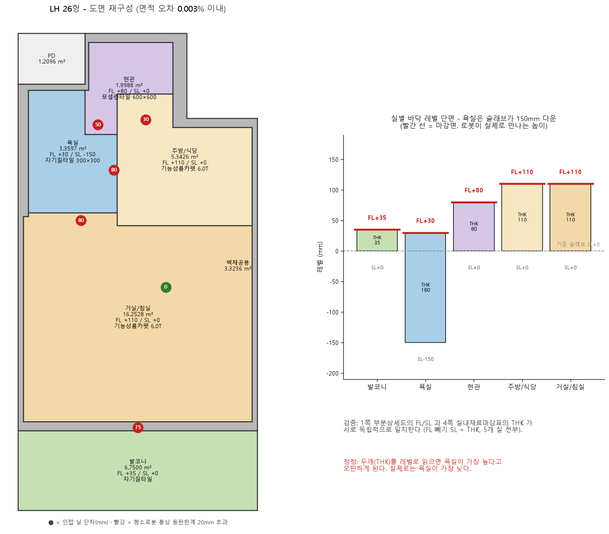
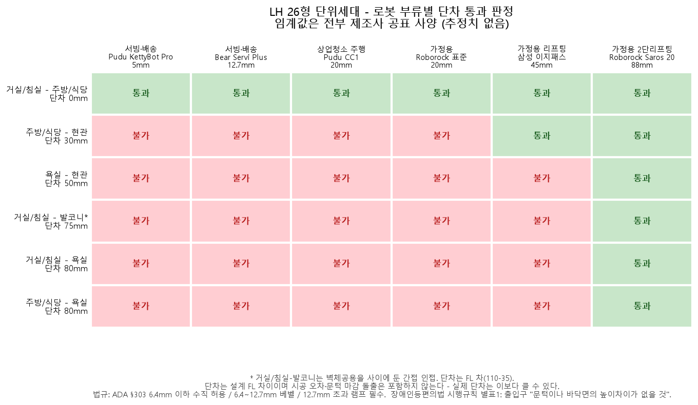
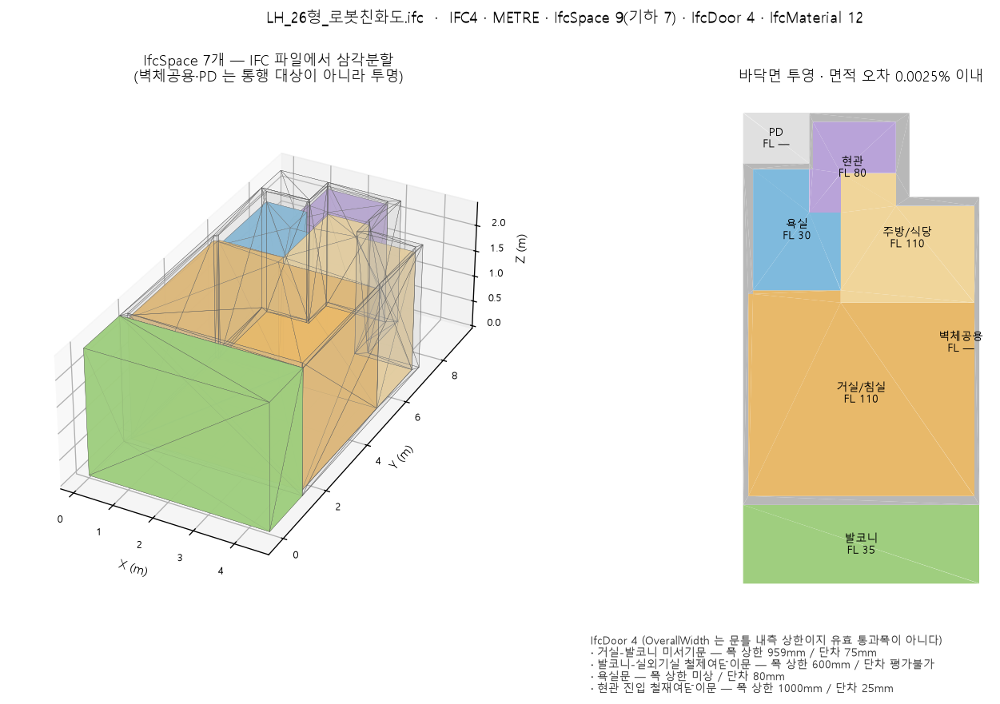
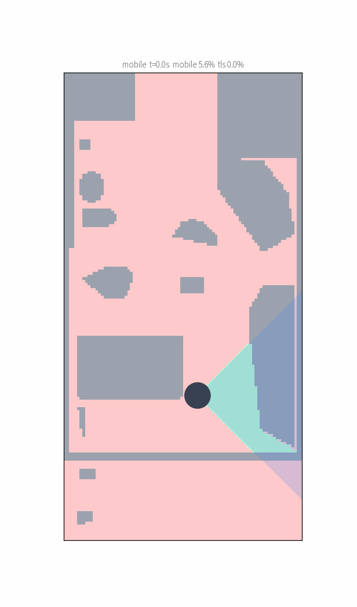
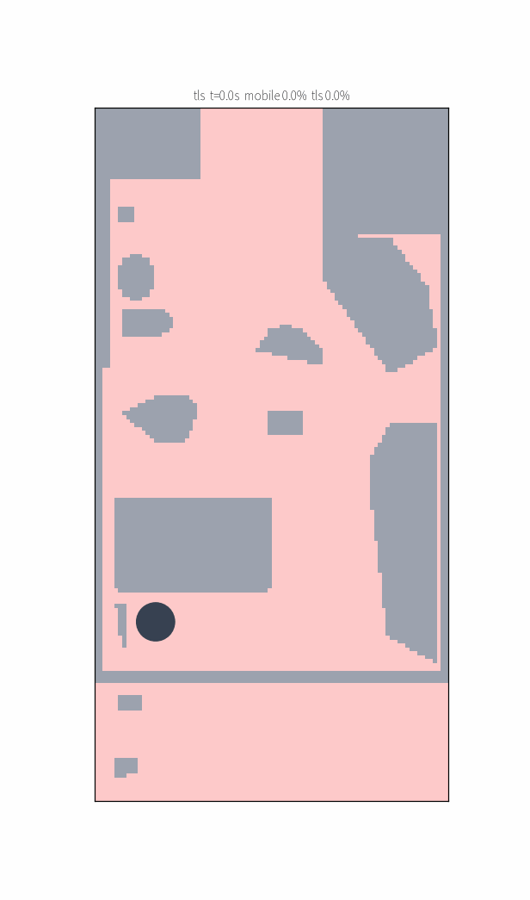
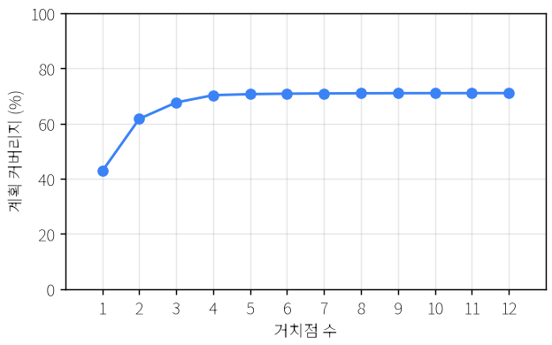
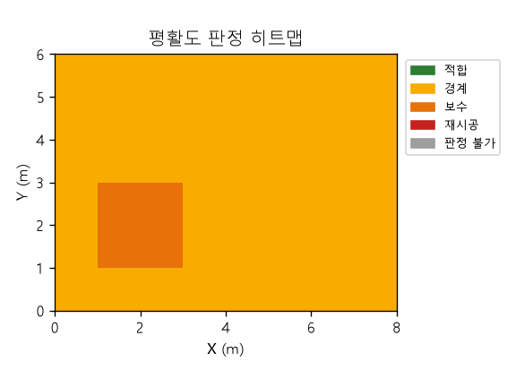
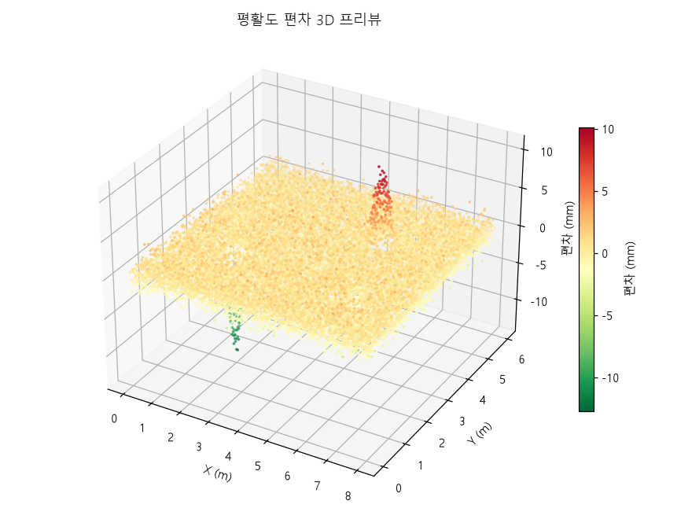
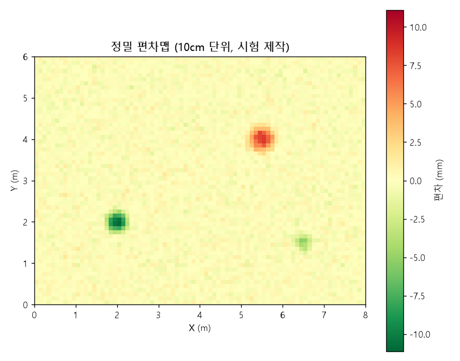

# Flatness — 건설 현장 로봇친화 환경 분석 시스템

국립한밭대학교 연구용역. LiDAR 점군과 건축 도면에서 출발해 **바닥 평활도·구배 실측 분석**,
**로봇친화형 마감재 DB·BIM 연계**, **로봇 스캔 커버리지 시뮬레이션**까지 — 4개 세부과업을
하나의 저장소에서 수행합니다.

| 과업 | 내용 | 상태 |
|---|---|---|
| **1** | 수직·수평면 평활도 분석 + 자동 PDF 보고서 | 완료 · 배포 (Vercel + Railway + Supabase) |
| **2** | 로봇친화형 마감재 DB + BIM 연계 (도면 → IFC) | 완료 · DB 마이그레이션 편입 |
| **3** | 로봇 작업 모니터링·시뮬레이션 (스캔 커버리지) | 완료 · Gazebo 대조검증 |
| **4** | Point Cloud 기반 구배 자동 측정·분석 | 완료 · 배포 |

**테스트 652건** (engine 244 · worker 209 · bim 50 · scansim 149) + 워커 통합 209 ·
**변이 실험 3계열 전부 차단**(DB 41종 · 도면 복원 10종 · 판정 11종 · 시뮬 10종) ·
Gazebo 독립 물리 엔진 대조 **운행 거리 오차 +0.07%**.

---

## 결과물 미리보기

### 과업 2 — 도면에서 BIM으로

확보한 자료가 BIM 모델이 아니라 **샘플 도면(LH 발행, PDF)**이라, 도면에서 기하를 복원해 모델을 만들었습니다.
선 굵기(1.42pt)로 실 경계만 걸러 폴리곤화 — 복원 면적이 도면에 인쇄된 면적산출표와
**0.003% 이내**로 일치합니다.

| 도면 재구성 + 실별 바닥 레벨 | 로봇 부류별 단차 판정 |
|---|---|
|  |  |

욕실은 슬래브가 150mm 내려가 있어 **두께(THK)를 레벨로 읽으면 높낮이 방향이 뒤집힙니다** —
두 도면(부분상세도 FL/SL ↔ 마감표 THK)이 `FL − SL = THK`로 서로를 검증합니다. 판정 결과,
상업용 서빙·배송·청소·산업 AMR **4개 등급 전부 현관 30mm 단차에 막힙니다**(임계값은 전부
제조사 공표 사양, [근거 대조표](docs/robot-criteria-sources.md)).



IFC4로 내보낸 뒤 **파일을 다시 읽어 삼각분할**하는 왕복 검증 — 바닥 면적이 도면 면적표와
0.0025% 이내입니다. 도면에 없는 값(유효 통과폭·미기재 천장고)은 지어내지 않고 `unknown`·명목값
표식으로 남깁니다.

### 과업 3 — 스캔 커버리지 시뮬레이션

로봇의 작업은 LiDAR 스캔입니다 — 계획된 경로가 점군 밀도를 결정하고, 그 점군이 과업 1·4의
분석 입력이 됩니다. 커버리지 기준은 면적이 아니라 **점 밀도**입니다(모바일 ≤20mm / TLS ≤5mm).

| 모바일 (주행 중 촬영, 시야각 90°) | TLS (거치점 최적화 + 순회) |
|---|---|
|  |  |



TLS 거치점 배치는 greedy set cover, 순회는 nearest neighbor + 2-opt. 같은 기하를 SDF world로
변환해 **Gazebo(독립 물리 엔진)에서 같은 경유점을 주행**했습니다 — 운행 거리 오차 +0.07%.

### 과업 1·4 — 평활도·구배 실측 분석 (배포된 파이프라인)

업로드 → 분석 → 판정 히트맵 → PDF 보고서가 웹 대시보드에서 동작합니다. 아래는 합성 demo 점군
산출물입니다(실물 직선자 실측 대조는 미수행 — [보고서](docs/service-report.md) 6장).

| 판정 히트맵 (2m 셀) | 3D 프리뷰 | 10cm 정밀 편차맵 |
|---|---|---|
|  |  |  |

---

## 구성

```
engine/     평활도·구배 분석 엔진 (Python) — PLY/LAS/LAZ 리더, RANSAC, 직선자 포락선, 구배
worker/     잡 처리 워커 — Supabase 잡 큐 폴링, Jinja2 → Chromium PDF 보고서
dashboard/  웹 대시보드 (Next.js) — 업로드·결과 화면·정합·보고서
bim/        도면 PDF → 실 기하 복원 → IFC4 내보내기 + 로봇 주행 판정
scansim/    스캔 커버리지 계획(모바일·TLS)·시뮬레이션·Gazebo 대조검증
supabase/   마이그레이션 14개 + 검증 게이트 (verification/)
docs/       용역 결과 보고서(11장)·판정 기준 대조표 3종·데이터 계약·배포 절차
```

배포: Vercel(대시보드) + Railway(워커, Docker) + Supabase(DB·Auth·Storage).
절차와 주의사항은 [docs/DEPLOY.md](docs/DEPLOY.md).

## 실행

```bash
# 분석 엔진 (평활도) — pip install -e engine/ 후 `flatness` 로도 실행 가능
python -m flatness.cli analyze data/demo/demo_floor.ply --out out/

# 도면 → IFC
python bim/to_ifc.py && python bim/verify_ifc.py

# 스캔 커버리지 시뮬레이션 (CSV·JSON·PNG·GIF·PDF 일괄)
python -m scansim.cli --dump bim/tests/fixtures/lh26_dump.json --mode both --out out/

# 테스트
cd engine && python -m pytest -q          # 244
cd worker && python -m pytest -q          # 209
python -m pytest bim/tests/ scansim/tests/ -q   # 199
```

## 검증 방식

이 프로젝트의 회귀 기준은 단언 개수가 아니라 **심은 변이를 몇 개 죽였는가**입니다 — "프로덕션
코드는 맞는데 테스트가 정작 막으려던 회귀를 못 잡는" 사고가 반복되어, 변이 실험에 **무변이
대조군**을 필수로 두었습니다(없으면 "전부 차단"이 도구가 조용히 죽은 상태와 구별되지 않습니다).

수행하지 않은 검증은 수행했다고 적지 않습니다: 실물 직선자 실측 대조, 실물 드론·지상 스캔
대조, 실물 로봇 주행은 **미수행**이며 보고서에 그렇게 명시되어 있습니다. 예외적으로 도면 복원
정확도만은 합성이 아니라 **도면에 인쇄된 면적산출표와의 대조**입니다.

## 문서

| 문서 | 내용 |
|---|---|
| [service-report.md](docs/service-report.md) | 용역 결과 보고서 전문 — 1~8장 과업1 / 9장 과업4 / 10장 과업2 / 11장 과업3 |
| [criteria-sources.md](docs/criteria-sources.md) | 평활도 판정 기준 11종 원문 대조표 + 정직성 선언 |
| [slope-criteria-sources.md](docs/slope-criteria-sources.md) | 구배 판정 기준 대조표 |
| [robot-criteria-sources.md](docs/robot-criteria-sources.md) | 로봇 주행 임계값 29행 근거 대조표 |
| [contracts/finish-material-db.md](docs/contracts/finish-material-db.md) | 마감재 DB 트리 (카탈로그에서 생성) |
| [contracts/stats-schema.md](docs/contracts/stats-schema.md) | 분석 산출 데이터 계약 |
| [scan-guideline.md](docs/scan-guideline.md) | 현장 스캔 가이드라인 |
| [DEPLOY.md](docs/DEPLOY.md) | 배포 절차 (마이그레이션 순서·함정 포함) |

> 과업지시서 원문과 샘플 도면 PDF는 저장소에 포함하지 않습니다(`data/` gitignore).
> 저장소의 도면 관련 데이터는 전부 **파생 기하**(실 폴리곤·레벨·가구 좌표)입니다.
